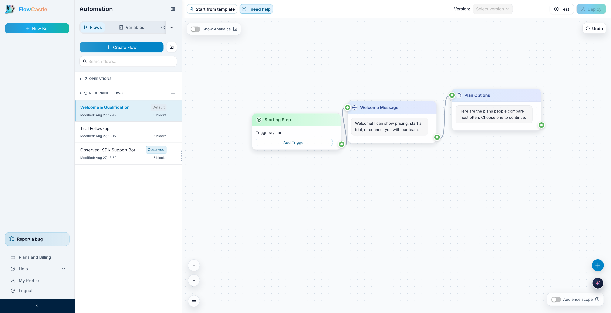
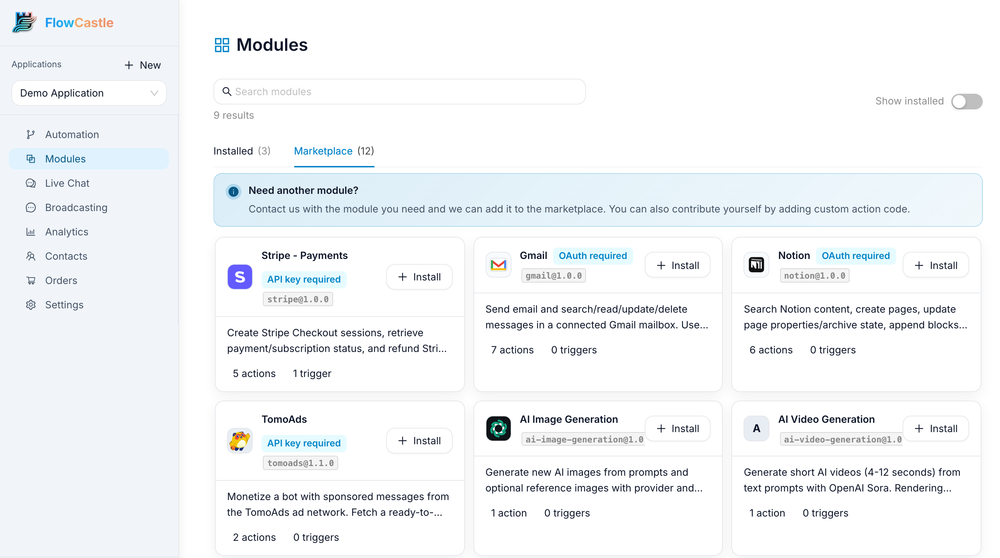
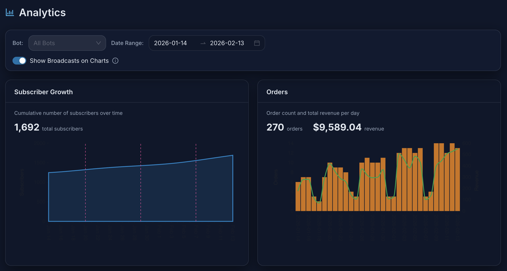
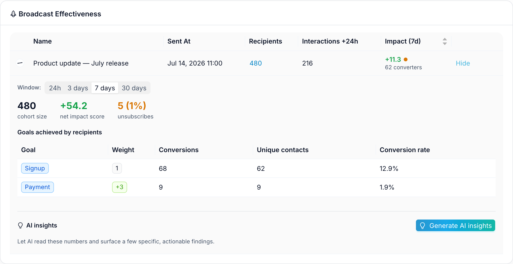
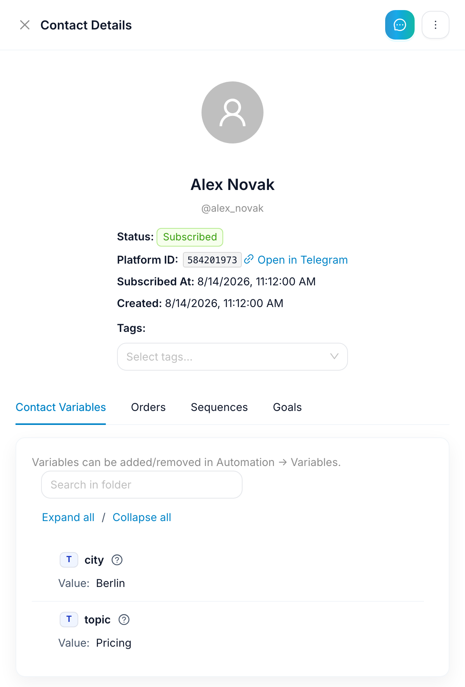

# FlowCastle SDK for Telegram bots

<p align="center">
  <strong>Add a contact CRM, Live Chat, broadcasts and conversion analytics to the Telegram bot you already have — grammY, Telegraf, aiogram or python-telegram-bot — without rewriting your handlers or handing over your bot token.</strong>
</p>

<p align="center">
  <a href="https://github.com/FlowCastle/flowcastle-sdk/actions/workflows/ci.yml"></a>
  <a href="https://www.npmjs.com/package/@flowcastle/grammy"></a>
  <a href="https://www.npmjs.com/package/@flowcastle/telegraf"></a>
  <a href="https://pypi.org/project/flowcastle/"></a>
  <a href="LICENSE"></a>
  <a href="https://flowcastle.ai"></a>
</p>

Writing bot code is fun. But code alone does not bring users, help a growth team
understand them, give support a shared inbox, or show which conversations
convert. FlowCastle is the layer around your bot that does — and this SDK plugs
it into the bot you already have.

## 30-second start

```bash
npm install @flowcastle/grammy      # or @flowcastle/telegraf
pip install 'flowcastle[aiogram]'   # or 'flowcastle[python-telegram-bot]'
```

```ts
import { Bot } from 'grammy';
import { flowcastle } from '@flowcastle/grammy';

const bot = new Bot(process.env.BOT_TOKEN!);
bot.use(flowcastle({ apiKey: process.env.FLOWCASTLE_API_KEY!, privacy: {} }));

bot.command('hello', (ctx) => ctx.reply('Still handled by my code'));
bot.start();
```

**Get an API key:** sign in to the [FlowCastle dashboard](https://dashboard.flowcastle.ai/register)
(free, no card), open your application and choose **Add bot → Code SDK**. You get an
`fc_sdk_…` key — FlowCastle never asks for your Telegram bot token.

That's it: contacts, message analytics, blocked-user detection and a live "connected"
indicator light up in the dashboard. Telegraf, aiogram and python-telegram-bot
snippets are [below](#integrate-in-minutes).

## What you get

[FlowCastle](https://flowcastle.ai) is the layer around your bot that turns a
working program into a product people can distribute, operate, and improve:

- **Contact CRM** — every user who talks to the bot, with tags, variables, orders and goals.
- **Live Chat** — hand a conversation to a human from a handler; the reply goes back through your bot.
- **Broadcasts, campaigns, drip sequences** — sent through your bot process, measured against goals.
- **Goals, funnels, conversion analytics** — `ctx.flowcastle.goal('paid')` from any handler.
- **A visual map of your existing bot** — FlowCastle reconstructs the conversations already happening in your code from sanitized SDK traffic, read-only, so growth and support can see what the bot does without reading the source.
- **No-code flows next to your code** — teammates build onboarding, follow-ups or support journeys in the visual editor; your code stays authoritative for everything else.

You do **not** have to rewrite your bot. Keep the framework, handlers, deployment,
database, and Telegram token you already own.

## Who this is for

- **Bot developers** who want to keep their architecture and ship the commercial
  layer without rebuilding CRM, campaigns, analytics, and support tooling.
- **Product teams** that need developers, marketers, operators, and support
  agents to work on the same customer journey without every change becoming a
  deploy.
- **Agencies and platform teams** maintaining multiple bots across different
  frameworks or languages while keeping one operating model.
- **Existing bots** whose conversation logic has become hard to see, measure,
  explain, or safely change.

## Code is the engine. FlowCastle is the cockpit.

Your application remains authoritative for bot transport and custom behavior.
FlowCastle adds the parts that become expensive and repetitive once a bot has
real users:

| Build in your code | Add with FlowCastle |
| --- | --- |
| Custom business logic and integrations | Contact CRM and audience context |
| Framework-native handlers | Live Chat and human handoff |
| Your deployment and data stores | Broadcasts, campaigns, and automated sequences |
| Specialized algorithms and domain behavior | Goals, funnels, and conversion analytics |
| Anything that deserves source control | Visual flows, ready modules, and collaborative editing |

This is not a choice between code and a visual builder. A command can stay in
code, call a FlowCastle flow for onboarding, return to custom logic, record a
goal, and later hand the conversation to a human—all through the bot process
you already operate.

## See your bot's conversations — and add no-code ones beside them



The same workspace holds two kinds of flows:

| Observed from your code | Built in FlowCastle |
| --- | --- |
| Reconstructed automatically from sanitized SDK traffic | Created visually in the no-code editor |
| Read-only — your repository stays the source of truth | Editable and deployable by the teammates who own the journey |
| Makes code paths visible and connects them to analytics | Runs onboarding, campaigns, follow-ups, support, and other complementary automations |

Both run through one bot process. A deployed FlowCastle trigger can claim a matching
update, code can explicitly call an allowed flow, and everything unmatched
continues to your existing handlers. Delete an observed map at any time and
FlowCastle rebuilds it from fresh activity; it never touches the code that produced it.

## Integrate in minutes

Every adapter uses the same protocol and privacy model. Framework-specific code
stays deliberately thin. Add `runtime: { enabled: true }` to let FlowCastle-authored
flows run through your bot.

### grammY

```ts
import { Bot } from 'grammy';
import { flowcastle } from '@flowcastle/grammy';

const bot = new Bot(process.env.BOT_TOKEN!);
const fc = flowcastle({
  apiKey: process.env.FLOWCASTLE_API_KEY!,
  privacy: {}, // routing-only content; no optional contact fields
  runtime: { enabled: true },
});

await fc.ready();
bot.use(fc);

bot.command('hello', (ctx) => ctx.reply('Still handled by my code'));
bot.start();
```

Start a FlowCastle-authored flow or record a business outcome directly from an
existing handler:

```ts
bot.command('onboard', (ctx) =>
  ctx.flowcastle.runFlow('welcome-flow', {
    inputs: { source: 'telegram-command' },
  }),
);

bot.command('paid', async (ctx) => {
  ctx.flowcastle.goal('subscription_started', { plan: 'pro', value: 49 });
  await ctx.reply('Welcome to Pro');
});
```

Only flows explicitly marked `sdkCallable` can be started from application
code. Updates that match a deployed FlowCastle trigger are handled by the flow;
unmatched updates continue to your normal handlers.

<details>
<summary><strong>Telegraf</strong></summary>

```ts
import { Telegraf } from 'telegraf';
import { flowcastle } from '@flowcastle/telegraf';

const bot = new Telegraf(process.env.BOT_TOKEN!);
const fc = flowcastle({
  apiKey: process.env.FLOWCASTLE_API_KEY!,
  privacy: {},
  runtime: { enabled: true },
});

await fc.ready();
fc.wrapTelegram(bot.telegram);
bot.use(fc);

bot.command('support', async (ctx) => {
  ctx.flowcastle.requestLiveAgent({ note: 'Asked for a human' });
  await ctx.reply('A teammate will join here.');
});

bot.launch();
```

</details>

<details>
<summary><strong>Python · aiogram 3</strong></summary>

```python
import os
from aiogram import Bot, Dispatcher
from flowcastle import FlowCastleCore, FlowCastleOptions
from flowcastle.adapters.aiogram import AiogramAdapter

bot = Bot(os.environ['BOT_TOKEN'])
dispatcher = Dispatcher()
core = FlowCastleCore(FlowCastleOptions(
    api_key=os.environ['FLOWCASTLE_API_KEY'],
    privacy={},
    runtime_enabled=True,
))
adapter = AiogramAdapter(core)

await adapter.ready()
adapter.install(dispatcher)
await dispatcher.start_polling(bot)
```

Handlers receive `flowcastle` in middleware data: `await flowcastle.goal('paid')`.

</details>

<details>
<summary><strong>Python · python-telegram-bot 21/22</strong></summary>

```python
import os
from flowcastle import FlowCastleCore, FlowCastleOptions
from flowcastle.adapters.python_telegram_bot import PythonTelegramBotAdapter
from telegram.ext import Application

application = Application.builder().token(os.environ['BOT_TOKEN']).build()
core = FlowCastleCore(FlowCastleOptions(
    api_key=os.environ['FLOWCASTLE_API_KEY'],
    privacy={},
    runtime_enabled=True,
))
adapter = PythonTelegramBotAdapter(core)
adapter.install(application)

application.run_polling()
```

Handlers get `context.flowcastle` with `goal`, `identify`, `request_live_agent` and `run_flow`.

</details>

Want a complete project instead of a snippet? [`examples/`](examples) has a runnable
bot per framework — identify, goals, `/qualify` journey, Live Chat handoff and an optional
no-code follow-up flow.

Polling and webhooks both work — the SDK is middleware and never touches how
updates reach your process.

The framework-neutral protocol is the important part: adapters translate native
updates and Telegram calls, while matching, privacy, flow execution, leased
jobs, and acknowledgements remain consistent. That makes support for another
Telegram library—or another language—a small adapter project instead of a new
platform integration.

## Supported adapters

| Framework | Package | Runtime |
| --- | --- | --- |
| [grammY](https://grammy.dev) | `@flowcastle/grammy` | Node.js 18+ |
| [Telegraf](https://telegraf.js.org) | `@flowcastle/telegraf` | Node.js 18+ |
| [aiogram 3](https://docs.aiogram.dev) | `flowcastle[aiogram]` | Python 3.10+ |
| [python-telegram-bot 21/22](https://python-telegram-bot.org) | `flowcastle[python-telegram-bot]` | Python 3.10+ |

Using another library? The [cross-framework SDK plan](docs/CROSS_FRAMEWORK_TELEGRAM_SDK_PLAN.md)
documents the shared protocol, capability model, privacy contract, and the recipe
for adding a framework or language — open an issue and we'll help.

## Privacy is configured in your process

Trust should come from enforceable boundaries, not a promise on a landing page.
The SDK filters Telegram data **inside your bot process**, before an event can
enter its bounded in-memory buffer or a FlowCastle network request.

- **Your Telegram bot token stays with your application.** You do not pass it to
  FlowCastle, and the SDK does not take over polling, webhooks, or shutdown.
- **Telegram user ID is the only mandatory contact field.** It provides the
  stable identity needed to associate events with a contact. Optional profile
  fields—username, first name, last name, language, Premium status, and
  attachment-menu status—use a local allowlist.
- **Message content has three modes.** `full` supports text-dependent flows;
  `routing` keeps commands and callback action identifiers but removes free
  text and structured content; `none` retains only operational IDs, timestamps,
  and update shape.
- **You can redact with your own code.** A synchronous or asynchronous callback
  can replace or remove selected text before it leaves the process. A thrown
  error or timeout fails closed: that field is dropped, never sent unredacted.
- **Your handlers still receive the original update.** Sanitization happens on a
  copy used by the FlowCastle path and does not mutate framework objects.
- **Runtime access is constrained locally.** FlowCastle flow jobs can call only
  a hardcoded Telegram operation allowlist. Token, webhook, polling, and bot
  lifecycle methods are refused regardless of server input. Inline file data is
  validated; server-provided filesystem paths are never opened.

For new integrations, pass `privacy: {}` explicitly. That selects no optional
contact fields and `routing` message content. Omitting `privacy` currently keeps
legacy full-content behavior for compatibility.

### Share only the contact data you need

```ts
const fc = flowcastle({
  apiKey: process.env.FLOWCASTLE_API_KEY!,
  privacy: {
    contactFields: ['username', 'languageCode'],
    messageContent: 'routing',
  },
});
```

### Redact sensitive text locally

```ts
const fc = flowcastle({
  apiKey: process.env.FLOWCASTLE_API_KEY!,
  privacy: {
    contactFields: [],
    messageContent: {
      mode: 'full',
      transformText: ({ value, field }) => {
        if (field === 'contactVCard') return null;

        return value
          .replace(/\b[\w.+-]+@[\w.-]+\.\w+\b/g, '[EMAIL]')
          .replace(/\b\d{16}\b/g, '[CARD]');
      },
    },
  },
});
```

The automatic policy covers captured Telegram updates and observed outgoing
Bot API payloads. Values your application explicitly passes to `goal`,
`identify`, Live Chat notes, or flow inputs are developer-authored data and are
not implicitly transformed.

Read the complete contract in the [grammY privacy guide](packages/sdk-grammy/README.md#privacy-controls),
[Telegraf guide](packages/sdk-telegraf/README.md#privacy), and
[Python guide](packages/sdk-python/README.md).

## Performance contract

- **Ordinary updates never wait on FlowCastle.** After local privacy filtering and
  trigger matching, the event goes into a bounded in-memory queue and your handler
  runs immediately. Goals, identification and Live Chat requests use the same
  fire-and-forget path.
- **Bounded memory.** Flush every 3 s or at 20 events, max 50 per request, queue
  capped at 500 events (oldest dropped under pressure). Network/5xx failures get
  one background retry and never throw into your handlers.
- **Two things are awaited on purpose:** an update claimed by a FlowCastle flow
  (so your handler doesn't reply twice — failed hand-offs go to a bounded replay
  spool), and an explicit `runFlow` (it returns the execution id). An async
  `transformText` is awaited so raw content can never race past redaction.
- Both boundaries are covered by regression tests with a deliberately blocked
  `/events` endpoint. Full details in the [grammY](packages/sdk-grammy/README.md)
  and [Python](packages/sdk-python/README.md#performance-boundary) READMEs.

## What your team gets

<table>
  <tr>
    <td width="50%">
      <br>
      <sub><strong>Build faster.</strong> Add ready modules and integrations instead of rebuilding commodity features. The <a href="https://github.com/FlowCastle/telegram-bot-templates">FlowCastle MCP and bot templates</a> also let AI coding agents help draft and maintain bots and flows.</sub>
    </td>
    <td width="50%">
      <br>
      <sub><strong>Know what works.</strong> Connect conversations, subscriber growth, orders, revenue, and campaign activity in one analytics view.</sub>
    </td>
  </tr>
  <tr>
    <td width="50%">
      <br>
      <sub><strong>Improve distribution.</strong> Send targeted broadcasts and see their real effect on engagement, goals, and unsubscribes.</sub>
    </td>
    <td width="50%" align="center">
      <br>
      <sub><strong>Understand each contact.</strong> Give growth and support teams useful context without exposing fields your application has chosen not to share.</sub>
    </td>
  </tr>
</table>

FlowCastle shortens both development and feedback loops: launch with ready
modules, let non-developers operate the customer journey, and bring the results
back to developers as visible paths and measurable outcomes.

## Repository layout

- [`packages/sdk-runtime`](packages/sdk-runtime) — TypeScript protocol, privacy,
  claims, matching, attachments, spooling, and leased-job primitives.
- [`packages/sdk-grammy`](packages/sdk-grammy) — grammY middleware and transport.
- [`packages/sdk-telegraf`](packages/sdk-telegraf) — Telegraf middleware and
  transport.
- [`packages/sdk-python`](packages/sdk-python) — dependency-light Python core
  with optional aiogram and python-telegram-bot adapters.
- [`packages/sdk-conformance`](packages/sdk-conformance) — language-neutral
  protocol-v2 fixtures.
- [`examples`](examples) — runnable example bots for grammY, Telegraf, aiogram and
  python-telegram-bot.
- [`docs`](docs) — architecture, parity, rollout, and runtime design notes.

## Develop and test

```bash
pnpm install
python3 -m pip install -e './packages/sdk-python[dev,aiogram,python-telegram-bot]'
pnpm test
```

The credential-free suite builds every TypeScript package, exercises real
grammY, Telegraf, aiogram, and python-telegram-bot dispatchers without Telegram
credentials, runs the shared conformance fixtures, and checks the Python package
with strict mypy. Live Telegram testing is separate and requires dedicated test
credentials.

## Links & support

- [FlowCastle](https://flowcastle.ai) · [Dashboard](https://dashboard.flowcastle.ai/register) · [REST API docs](https://api.flowcastle.ai/api/public/docs) · [Blog](https://flowcastle.ai/blog)
- Bot templates + MCP server for AI coding agents: [FlowCastle/telegram-bot-templates](https://github.com/FlowCastle/telegram-bot-templates)
- Questions or a framework request: [open an issue](https://github.com/FlowCastle/flowcastle-sdk/issues). If the SDK is useful to you, a ⭐ helps other bot developers find it.

## Security

Please do not report vulnerabilities in a public issue. Follow
[`SECURITY.md`](SECURITY.md) and use GitHub's private vulnerability reporting.

## License

[MIT](LICENSE)
